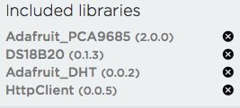

# Particle Photon Aquarium Controller
Particle Photon code for aquarium controller

Create project on [build.particle.io](https://build.particle.io) using files in the particle-project folder. You will also need to setup library dependencies as below:

For more details see [blog post at durablescope.com](http://blog.durablescope.com/post/AquariumLightingController/).

